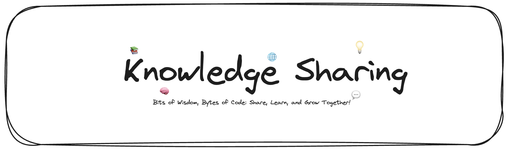

 

  💡 Welcome to the Knowledge Sharing Repository! 💡

 
 

## About ✨
This repository is a collection of insights, code snippets, and valuable information gathered from various learning experiences. Organized into different folders based on topics such as GO, AWS, and more, this repository is aimed at sharing knowledge with the community.

## Motivation ❤️

> _"Learn, Share, Grow"_

I find it easy to learn new things, but I forget them quickly too. So, the main idea here is about learning in a smart way. One way I do that is by taking notes. I used to write them on paper, and I even wrote code on paper sometimes. It might sound strange, but even now, I remember what I wrote two years ago, line by line. That's the magic of taking notes.

Another important thing is sharing what you've learned with others. It's like levels of learning. First, there's just learning. Then, taking notes about what you learned is the next level. And the highest level is sharing and teaching what you know to someone else. In most cases, achieving this final level ensures a strong understanding of the topic, making it less likely to be forgotten easily.

Despite having separate repositories for notes and sharing knowledge in the past, I've decided to put them all together in one easy-to-find and organized place.

This repository stands as a testament to the belief that knowledge becomes more powerful when shared among enthusiasts and learners.

## Table of Contents 📜
- [GO](https://github.com/mutasim77/knowledge-sharing/blob/master/The%20Go%20Programming%20Language/README.md) - Discover the world of Go programming language. 🐹
- [AWS](https://github.com/mutasim77/knowledge-sharing/blob/master/AWS%20Cloud%20Computing/README.md) - Dive into the Cloud Computing with Amazon Web Services. 🪄
- [Software Testing](https://github.com/mutasim77/knowledge-sharing/blob/master/Software%20Testing/README.md) -  🧪 Test your skills, one note at a time! Explore testing! 🔍

## Contributing 🔗
Your contributions are highly encouraged! If you've learned something new or have valuable insights to share, feel free to contribute. Here's our [Contribution guide](https://github.com/mutasim77/knowledge-sharing/blob/master/.github/CONTRIBUTING.md); please read it, and you're welcome to contribute!
